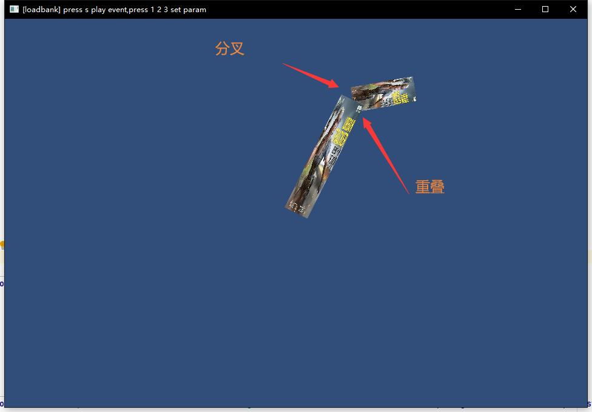
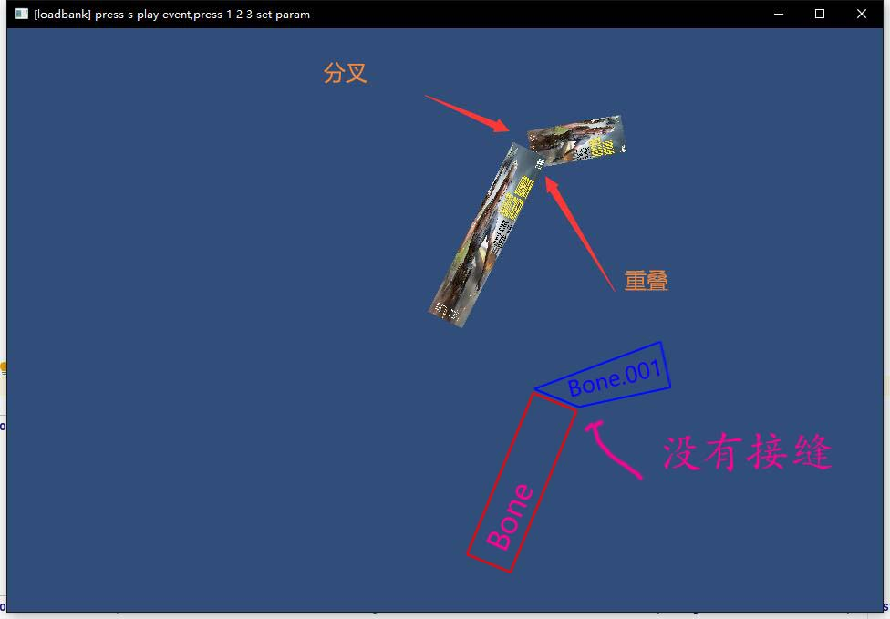
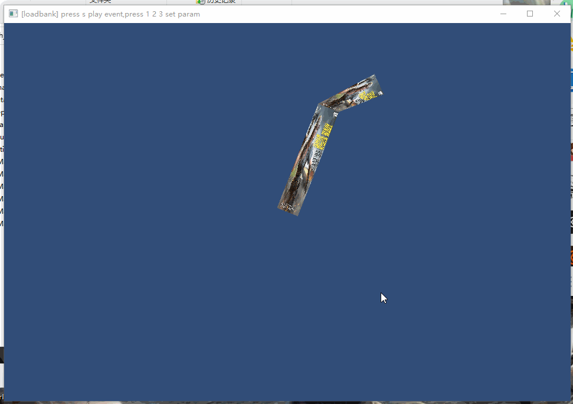
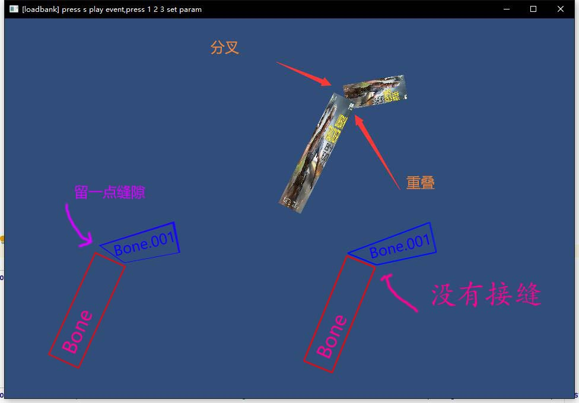
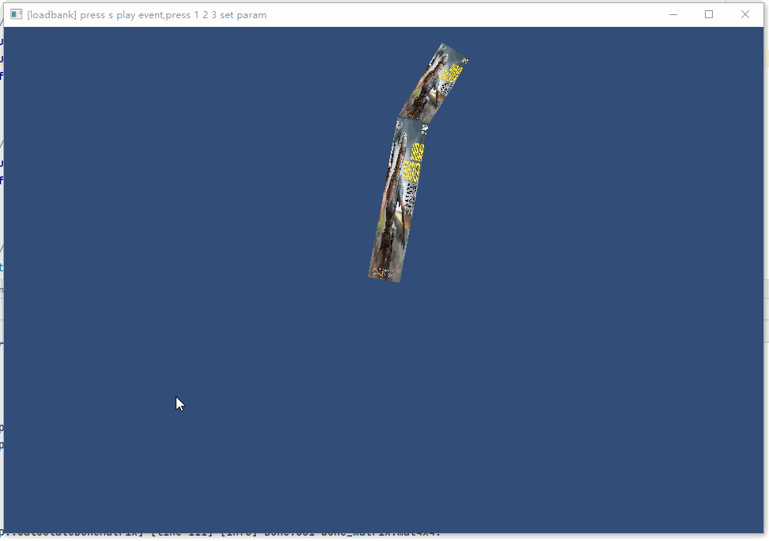
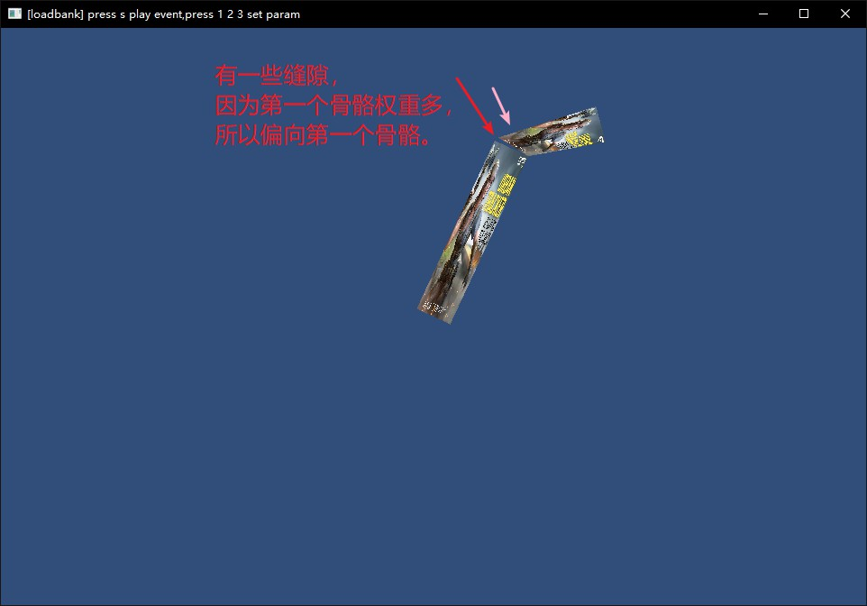

## 19.2 骨骼权重

```bash
CLion项目文件位于 samples\skinned_mesh_renderer\bone_weight
```

在上一节手动创建Mesh，为每一个顶点指定了关联的骨骼，解析骨骼动画数据后，成功让顶点跟随骨骼动起来了。

这就实现了传说中的骨骼动画。

不过还是有点小问题，如下图：



骨骼接缝处有分叉和重叠，这在游戏中就被称之为：<font color=red>穿模</font>。

### 1. 完美的效果

那如何做出完美的效果呢，就像下图我画出来的。



没有接缝，其实就是说，Bone.001的底部 2个顶点，和 Bone 的顶部两个顶点重合。

也就是说， Bone.001的底部 2个顶点，是跟随 Bone 在运动，而不是跟随 Bone.001 在运动。

这就很简单了，只要在构造Mesh的时候，设置这两个顶点跟随第一个骨骼 运动就行。

```lua
--file:example/login_scene.lua line:50

local vertex_relate_bone_index_vec=sol2.convert_sequence_uchar({--顶点关联的骨骼序号
    0, 0, 0, 0,
    0, 0, 1, 1    --原来是 1,1,1,1 修改为 0,0,1,1。注意对应顶点索引。
})
```

效果如图：



### 2. 骨骼权重

前面说的，顶点跟随哪个骨骼运动，这说的就是骨骼权重。

Bone.001的底部 2个顶点，跟随 Bone 在运动，说明这两个顶点在 Bone 这根骨骼上的权重是1，在 Bone.001 这根骨骼上的权重是0.

那我现在要留一点缝隙，但是又没有最初那么大的缝隙，要怎么做？



很直接就想到了，Bone.001左下角这个顶点，不能完全跟随 Bone，也不能完全跟随 Bone.001，而是同时受到两者影响。

这个时候就要对多个骨骼分配权重。

按照图中缝隙的大小与最初的分叉大小，大概确定了以下骨骼权重：

```bash
Bone: 0.7
Bone.001: 0.3
```

因为从图来看，还是靠近Bone多一些，所以 Bone 的权重多一些。

### 3. 构造骨骼权重数据

按游戏的常规做法，一个顶点关联的骨骼不会超过4个，所以可以用`char`来存储顶点关联的骨骼序号。

而多个骨骼共享的权重总和是1.0，也可以用`char`来存储单个骨骼的权重，用整数存储，用的时候除以100就行。

```bash
Bone: 70
Bone.001: 30
```

单个顶点关联的骨骼及权重，用结构`VertexRelateBoneInfo`来存储。

```c++
//file:source/renderer/mesh_filter.h line:84

/// 顶点关联骨骼及权重,每个顶点最多可以关联4个骨骼。
struct VertexRelateBoneInfo{
    char bone_index_[4];//骨骼索引，一般骨骼少于128个，用char就行。
    char bone_weight_[4];//骨骼权重，权重不会超过100，所以用char类型就可以。
};
```

所有顶点关联的骨骼权重，存储在`MeshFilter::vertex_relate_bone_infos_`中：

```c++
private:
    ......
    VertexRelateBoneInfo* vertex_relate_bone_infos_= nullptr;//顶点关联骨骼信息(4个骨骼索引、权重)，长度为顶点数
```

那么上一节手动创建的顶点与骨骼关系数据，就修改成如下：

```lua
--file:example/login_scene.lua line:53

--顶点关联骨骼信息,按照 bone_index_[4] bone_weight_[4] 的顺序存储
local vertex_relate_bone_infos=sol2.convert_sequence_int({
    0, -1, -1, -1, --[[左边骨骼，右边权重]] 100, -1, -1, -1,--第一个顶点：关联骨骼0，权重是1。注意-1表示无骨骼。
    0, -1, -1, -1, --[[左边骨骼，右边权重]] 100, -1, -1, -1,--第二个顶点同理
    0, -1, -1, -1, --[[左边骨骼，右边权重]] 100, -1, -1, -1,--第三个顶点同理
    0, -1, -1, -1, --[[左边骨骼，右边权重]] 100, -1, -1, -1,--第四个顶点同理

    0,  1, -1, -1, --[[左边骨骼，右边权重]] 70,  30, -1, -1,--第一个顶点：关联骨骼0，权重0.7，关联骨骼1，权重0.3。
    0, -1, -1, -1, --[[左边骨骼，右边权重]] 100, -1, -1, -1,--第二个顶点：关联骨骼0，权重1.
    1, -1, -1, -1, --[[左边骨骼，右边权重]] 100, -1, -1, -1,--第三个顶点：关联骨骼1，权重1.
    1, -1, -1, -1, --[[左边骨骼，右边权重]] 100, -1, -1, -1,--第四个顶点：关联骨骼1，权重1.
})
mesh_filter:set_vertex_relate_bone_infos(vertex_relate_bone_infos)
```

数据是以数组形式，从Lua传入到C++之后，先存入std::vector，再复制到`MeshFilter::vertex_relate_bone_infos_`，代码如下：

```c++
//file:source/renderer/mesh_filter.h line:90

/// 获取顶点关联骨骼信息(4个骨骼索引、骨骼权重)，长度为顶点个数
VertexRelateBoneInfo* vertex_relate_bone_infos(){return vertex_relate_bone_infos_;};

/// 设置顶点关联骨骼信息
/// \param vertex_relate_bone_info_vec unsigned char数组形式，长度为顶点个数*8.
/// 每个顶点按照 bone_index_[4] bone_weight_[4] 的顺序存储，
void set_vertex_relate_bone_infos(std::vector<int>& vertex_relate_bone_info_data){
    if(vertex_relate_bone_infos_!=nullptr){
        delete[] vertex_relate_bone_infos_;
        vertex_relate_bone_infos_ = nullptr;
    }
    size_t data_size=vertex_relate_bone_info_data.size()*sizeof(char);
    vertex_relate_bone_infos_= static_cast<VertexRelateBoneInfo*>(malloc(data_size));
    for (int i = 0; i < data_size; ++i) {
        ((char*)vertex_relate_bone_infos_)[i]=vertex_relate_bone_info_data[i];
    }
}
```

### 4. 实现骨骼权重

我们先用 Bone 的矩阵作用于顶点，算出坐标 pos_by_bone。

然后再用 Bone.001 的矩阵作用于顶点，算出坐标 pos_by_bone_0_0_1。

然后分别乘以权重，再相加，得到最终坐标。

```bash
new_pos = pos_by_bone * 0.7 + pos_by_bone_0_0_1 * 0.3
```

就这样得到了新的顶点坐标，代码如下：

```c++
//file:source/renderer/skinned_mesh_renderer.cpp line:38

void SkinnedMeshRenderer::Update() {
    ......

    //获取顶点关联骨骼信息(4个骨骼索引、骨骼权重)，长度为顶点个数
    auto vertex_relate_bone_infos=mesh_filter->vertex_relate_bone_infos();
    if(!vertex_relate_bone_infos){
        DEBUG_LOG_ERROR("SkinnedMeshRenderer::Update() failed, can't get vertex_relate_bone_infos");
        return;
    }

    ......

    //计算当前帧顶点位置
    for(int i=0;i<skinned_mesh->vertex_num_;i++){
        auto& vertex=mesh->vertex_data_[i];

        glm::vec4 pos_by_bones;//对每个Bone计算一次位置，然后乘以权重，最后求和

        for(int j=0;j<4;j++){
            auto& bone_index=vertex_relate_bone_infos[i].bone_index_[j];//顶点关联的骨骼索引
            if(bone_index==-1){
                continue;
            }
            float bone_weight=vertex_relate_bone_infos[i].bone_weight_[j]/100.f;//顶点关联的骨骼权重

            //获取当前顶点关联的骨骼T-Pos矩阵
            glm::mat4& bone_t_pose_matrix=animation_clip->GetBoneTPose(bone_index);
            //获取T-Pos矩阵的逆矩阵
            glm::mat4 bone_t_pose_matrix_inverse=glm::inverse(bone_t_pose_matrix);
            //将顶点坐标转换到骨骼空间
            glm::vec4 vertex_position=bone_t_pose_matrix_inverse*glm::vec4(vertex.position_,1.0f);

            //当前帧顶点关联的骨骼矩阵
            auto& bone_matrix=bone_matrices[bone_index];
            //计算当前帧顶点位置(模型坐标系，bone_matrix里带了相对于模型坐标系的位置，作用到骨骼坐标系的位置上，就转换到了模型坐标系)
            glm::vec4 pos_in_world=bone_matrix*vertex_position;

            //乘以权重
            pos_by_bones=pos_by_bones+pos_in_world*bone_weight;
        }

        skinned_mesh->vertex_data_[i].position_=pos_by_bones.xyz();
    }
}
```

### 5. 测试

效果如图：





因为第一个骨骼权重多，所以这个顶点还是偏向于Bone的。

测试OK。