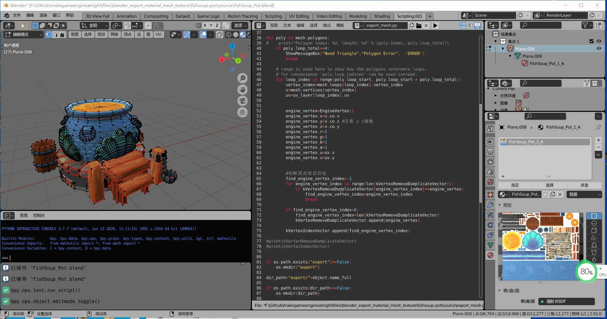
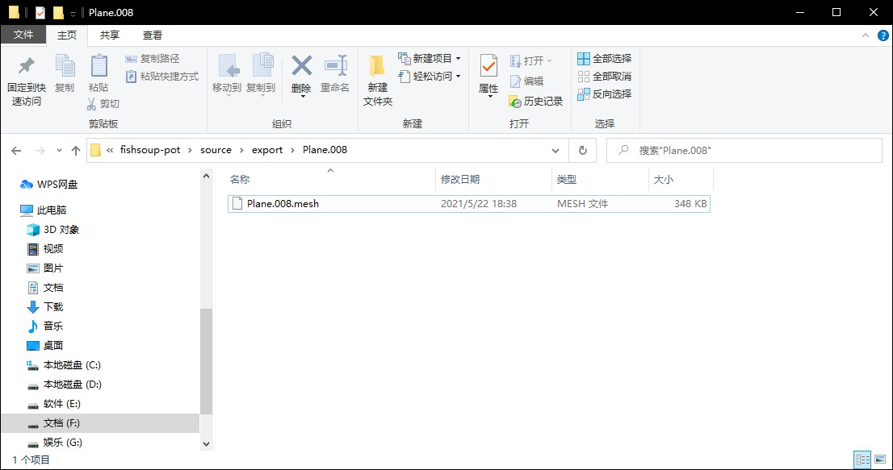

## 8.5 Blender Python 导出顶点数据

学习Blender Python脚本的最终目的是导出模型为我们引擎的独有格式模型文件。

### 1. 编写导出代码

下面这段代码，就实现了导出顶点坐标、索引、UV数据。

```python
#export_mesh.py
import bpy
import bmesh
import os
import struct


class EngineVertex:
    x=0
    y=0
    z=0
    r=0
    g=0
    b=0
    a=0
    u=0
    v=0
    
    def __eq__(self,other):
        return self.x==other.x and  self.y ==other.y and  self.z ==other.z and  self.r ==other.r and  self. g==other.g and  self.b ==other.b and  self.a ==other.a and  self.u ==other.u and  self.v ==other.v


def ShowMessageBox(message = "", title = "Message Box", icon = 'INFO'):
    def draw(self, context):
        self.layout.label(text=message)
    bpy.context.window_manager.popup_menu(draw, title = title, icon = icon)

# Get the active mesh
object=bpy.context.object
mesh = object.data
uv_layer = mesh.uv_layers.active.data
    
print("----EXPORT-----------------------------------")


kVertexRemoveDumplicateVector=[]
kVertexIndexVector=[]

for poly in mesh.polygons:
    print("Polygon index: %d, length: %d" % (poly.index, poly.loop_total))
    if poly.loop_total==4:
        ShowMessageBox("Need Triangle","Polygon Error",  'ERROR')
        break
    
    # range is used here to show how the polygons reference loops,
    # for convenience 'poly.loop_indices' can be used instead.
    for loop_index in range(poly.loop_start, poly.loop_start + poly.loop_total):
        vertex_index=mesh.loops[loop_index].vertex_index
        v=mesh.vertices[vertex_index]
        uv=uv_layer[loop_index].uv

        
        engine_vertex=EngineVertex()
        engine_vertex.x=v.co.x
        engine_vertex.y=v.co.z #注意 y z调换
        engine_vertex.z=v.co.y
        engine_vertex.r=1
        engine_vertex.g=1
        engine_vertex.b=1
        engine_vertex.a=1
        engine_vertex.u=uv.x
        engine_vertex.v=uv.y
        
        
        #判断顶点是否存在
        find_engine_vertex_index=-1
        for engine_vertex_index in range(len(kVertexRemoveDumplicateVector)):
            if kVertexRemoveDumplicateVector[engine_vertex_index]==engine_vertex:
                find_engine_vertex_index=engine_vertex_index
                break
        
        if find_engine_vertex_index<0:
            find_engine_vertex_index=len(kVertexRemoveDumplicateVector)
            kVertexRemoveDumplicateVector.append(engine_vertex)
            
        kVertexIndexVector.append(find_engine_vertex_index)
        
print(kVertexRemoveDumplicateVector)
print(kVertexIndexVector)


if os.path.exists("export")==False:
    os.mkdir("export")
    
dir_path="export/"+object.name_full

if os.path.exists(dir_path)==False:
    os.mkdir(dir_path)
    
with open(dir_path+"/"+object.name_full+'.mesh', 'wb') as f:
    #写入文件头
    f.write("mesh".encode())
    f.write(struct.pack('H',len(kVertexRemoveDumplicateVector)))
    f.write(struct.pack('H',len(kVertexIndexVector)))
    
    #写入顶点数据
    for engine_vertex in kVertexRemoveDumplicateVector:
        f.write(struct.pack('f',engine_vertex.x))
        f.write(struct.pack('f',engine_vertex.y))
        f.write(struct.pack('f',engine_vertex.z))
        f.write(struct.pack('f',engine_vertex.r))
        f.write(struct.pack('f',engine_vertex.g))
        f.write(struct.pack('f',engine_vertex.b))
        f.write(struct.pack('f',engine_vertex.a))
        f.write(struct.pack('f',engine_vertex.u))
        f.write(struct.pack('f',engine_vertex.v))

    #写入索引数据
    kVertexIndexVectorInverse=kVertexIndexVector[::-1]
    for engine_vertex_index in kVertexIndexVectorInverse:
        f.write(struct.pack('H',engine_vertex_index))
    
    f.close()
    
print("----SUCCESS-----------------------------------")
```

需要注意，在3d制作软件里，默认都是4边形，但是游戏引擎都只支持三角形。

在Blender中，四边形转三角形的方式是：

```bash
在编辑模式下，按 A 全选，然后 Ctrl+T 进行面三角化。
```

然后注意修改顶点绕序。

```python
#写入索引数据
    kVertexIndexVectorInverse=kVertexIndexVector[::-1]
```

### 2. 实战导出

简单的立方体已经无感了，需要精美的模型才能让人坚持往下学习。

sketchfab就是一个3d模型交流网站，上面提供了付费、免费的模型下载。

```bash
https://sketchfab.com
```


sketchfab上下载一个 Blender 模型

```bash
https://sketchfab.com/3d-models/fishsoup-pot-5a39e8c683f946b1aeb848dd2e88deb8
```


下载过来，贴图拖一下，修改为透明，我这里已经处理好了，放在下面目录。

```bash
files\blender_export_material_mesh_texture\fishsoup-pot\source
```

用Blender打开项目文件`FishSoup_Pot.blend`，并执行上面写好的代码导出Mesh，如下面动图：



导出完成后，打开下面目录，可以看到导出的Mesh文件。

```bash
files\blender_export_material_mesh_texture\fishsoup-pot\source\export\Plane.008
```




参考文档：

```bash
https://docs.blender.org/api/current/bpy.types.Mesh.html#bpy.types.Mesh.polygons
```