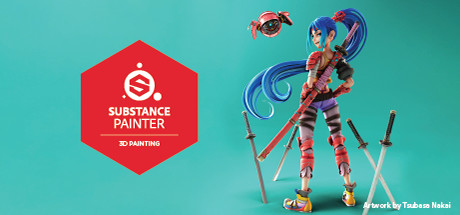
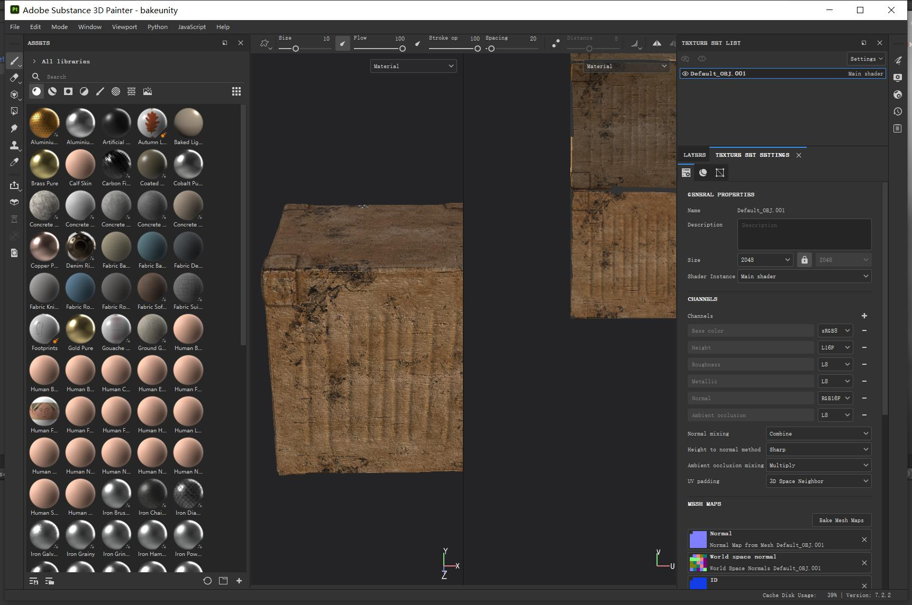
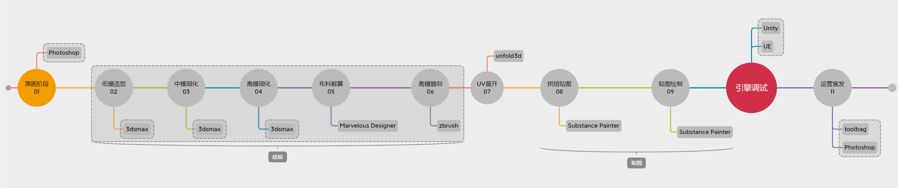
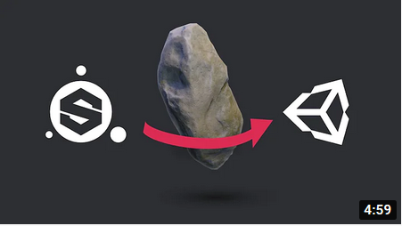
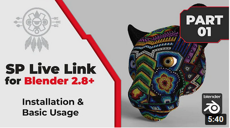
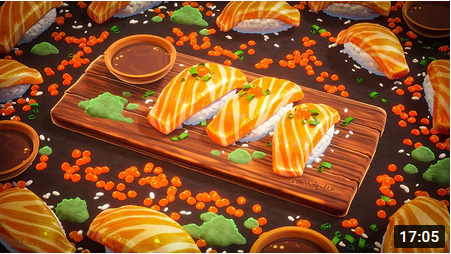

## 98. SubstancePainter插件开发

Substance Painter，简称SP，是次世代PBR建模的必备软件，主要负责烘焙、绘制贴图，也可以当做一个Renderer来出效果图。

SP在PBR建模流水线中的阶段如下图所示：

<b>需要开发哪些插件？</b>

对SP的开发主要有2方面：
1. 功能向，如导入导出插件、合并贴图、自定义贴图文件名、Live Link等。

     

2. 渲染向，例如调整为水墨风格、手绘风格等。

     

后续分别以一个实例，来进行介绍。

