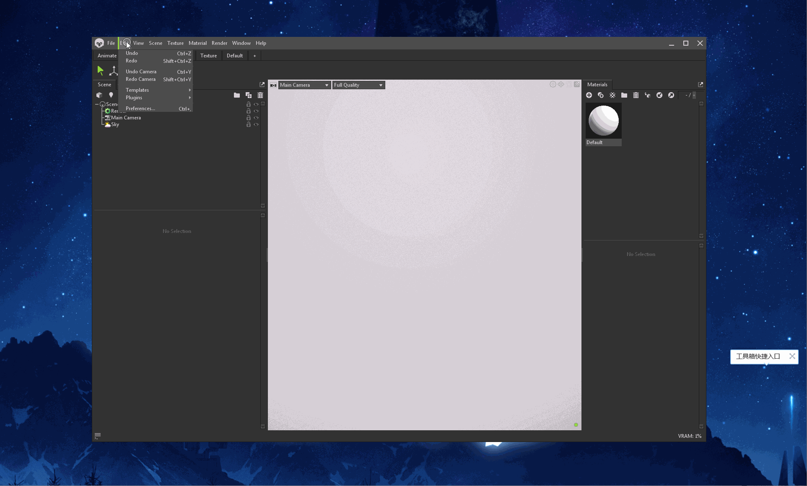
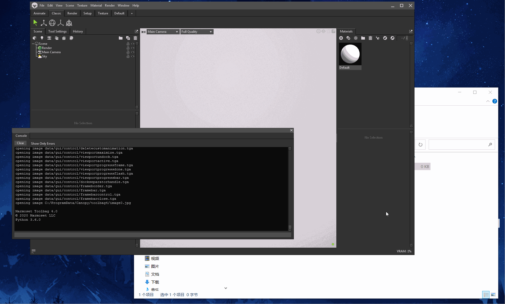

## 99.1 插件开发环境

官方文档：`https://marmoset.co/posts/python-scripting-toolbag/`

Toolbag的插件，必须以Python脚本形式，存放在指定目录中，才可以被识别。

点击菜单 Edit - Plugin - Show User Plugin Folder，打开插件目录。

在文件夹中新建 `helloworld.py`，然后点击菜单 Edit - Plugin - Refresh 刷新插件列表，就可以看到`helloworld`出现在插件列表。

### 编写插件代码

程序员关注的当然是代码了，先来一套 helloworld 就可以入门了。

打开`helloworld.py`，复制粘贴 Python版 `helloworld` ，保存，在菜单点击运行。

这样就写好了一个Toolbag插件。
