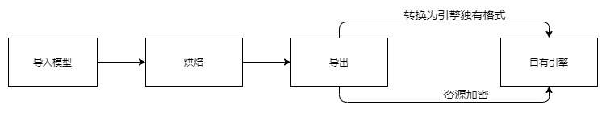

## 99.4 更多实现

在不同的项目，基于不同的引擎方案，toolbag可能在多种流程中发挥作用，我想到一些未来可能需要实现的需求，将方案记录下来。

- toolbag烘焙导出插件
  
  不同于u3d、ue，自有引擎对游戏资源的预处理可能比较简单。

  例如本书实例代码，仅支持`.cpt`图片格式，那么toolbag处理之后，需要将模型、图片导出为引擎支持的格式。
  
  又可能引擎仅直接支持加密后的资源，那么toolbag处理后，导出时直接进行加密就比较方便。
  
    

- Live Link
   
   设计师在toolbag中调试好材质后，需要导出到引擎中，进入游戏才能看到效果。

   有了Live Link后，toolbag中的材质参数修改将同步至引擎中，设计师可以实时对比引擎和toolbag效果，以作出调整。

